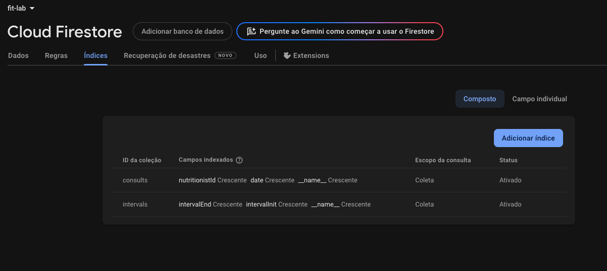
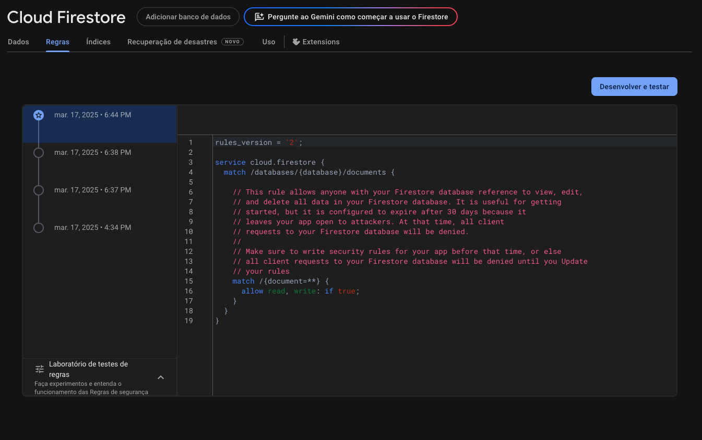
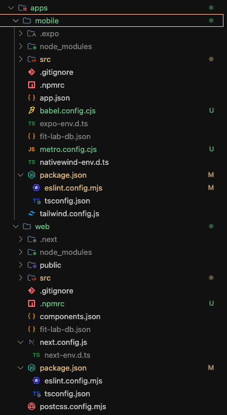

## Fit lab Teste

<strong>
  Este projeto tem como principal motivo, a apresentação de minha habilidades como desenvolvedor front-end e mobile, aos desenvolvedores da empresa fit-lab. Neste projeto procurei demonstrar meus conhecimentos com tecnologias utilizadas pela empresa, essas são, Next.js, React native (Expo) e firebase.
</strong>


## Informações importantes!
<span> Este projeto foi desenvolvido em uma arquitetura de monorepo, para que pudéssemos colocar ambos os projetos em um mesmo lugar, sendo mais fácil a reutilização de pacotes, tais como, configurações do <strong> eslint </strong> e <strong> typescript </strong>.

</br>

<strong>Obs: é um requisito mínimo para este projeto que você possua o gerenciador de pacotes para node <a href="https://pnpm.io/pt/">pnpm@10.6.5</a> instalado em sua máquina.

## Tecnologias utilizadas
  - Web
    - React 19
    - Next.js 15
    - React Query
    - Zustand
    - Shadcn/ui
    - React Hook Form
    - Radix UI
    - Fire Base
    - Tailwindcss
    - eslint
    - typescript
  
  - Mobile
    - Expo SDK 52
    - React 18
    - React Query
    - Async Storage
    - Sonner Toast
    - Fire Base
    - Native wind
    - Tailwindcss
    - eslint
    - typescript

</br>

<strong>
Obs: Ao aceitar esse desafio, um dos requisitos, era que deveríamos utilizar o styled-components como ferramenta de estilizações de componentes, porém enfrentamos algumas dificuldades ao tentar implementar junto com o expo 52. Sendo assim, optamos em utilizar o <a href="https://www.nativewind.dev/">nativewind</a> que é uma biblioteca que traz para nós a possibilidade de estilizar os nossos components nativos usando <a href="https://tailwindcss.com/">Tailwindcss</a>. Isso trouxe ao projeto uma padronização, pois a web utiliza tailwind e uma facilidade enorme, pois a configuração do nativewind é relativamente fácil, e as estilizações dos componentes, são definidas através de classNames, não sendo necessário a criação de arquivos segregados para componentes e assim, deixando os components e páginas mais simples.
</strong>

## Configurando o projeto

  1. Realize o clone do projeto
    
  ```shell
    gh repo clone Gustavo-Murdiga88/fit-lab-test && cd fit-lab-test
  ```
  2. Faça a instalação das dependências do projeto.

   ```shell
    pnpm install 
  ```
</br>

  3. Crie um cloud fire store
    
  - Crie um banco de dados no cloud <a href="https://firebase.google.com/products/firestore?hl=pt-br">fire-store</a>
  
  - Após a criação do banco crie dois indices da seguinte forma

   

  - Configure o acesso total o banco de dados
  

  - Então crie um json do google dentro do seu painel de console para criar a permissão de uso banco de dados. <a href="https://console.cloud.google.com/">google console</a>

  - Ao gerar o JSON key, adicione na raiz de cada projeto. Renomeie o arquivo para "fit-lab-db.json" 

    


  - obs: esta é uma aplicação de teste, por isso não estamos se atentando a segurança dos dados, estamos criando um ambiente simples para que tudo funcione de forma descomplicada!
  Aos desenvolvedores que irão fazer review do projeto, se sintam a vontade para me chamar que posso passar para vocês o json-key. *Após 7 dias desta publicação irei excluir o banco de dados para que haja uso do banco de dados de forma não supervisionada, sendo assim, após este período você deverá criar suas próprias configurações* 
  
</br>

  4. Execute o projeto

   ```shell
    pnpm run dev
  ```
  <strong>obs: Se caso preferir você pode ir até cada pasta do projeto e executar os apps de forma independentes </strong>

   ```shell
    cd apps/web && pnpm run dev
    cd apps/mobile && pnpm run dev
  ```

  ## Exemplos do funcionamento do sistema

   - web
  

  - mobile

    

  - Realtime
  
  
  
  - Delete Realtime
   


  ## Agradecimentos
  <strong> agradeço a todos por me darem esta oportunidade foi um desafio diferente que pude desenvolver, porém devido as correrias do dia-a-dia não pude focar 100% no projeto de forma integral. Mas acredito que foi este contempla boas práticas, e uma forma simples de desenvolvimento que é o que as grandes empresas hoje procuram em um bom desenvolvedor. De qual quer forma, se o meu teste não for selecionado, agradeço por ter chego até aqui!
  Até breve se Deus quiser!
  </strong>

  <em>
  Att, Gustavo Murdiga
  <em>

  